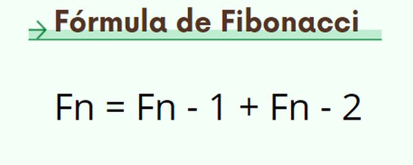
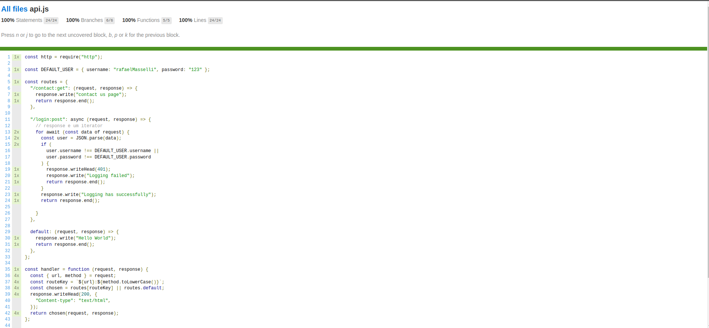

<h1 align="center"> Testes de software com javascript NodeJs</h1>

### [Testes com mock](./mocks/)

Objetos mock, objetos simulados ou simplesmente mock em desenvolvimento de software são objetos que simulam o comportamento de objetos reais de forma controlada. São normalmente criados para testar o comportamento de outros objetos.

### [Testes com metodo stubs](./stubs/)

Um stub ou method stub, em português esboço de método, em desenvolvimento de software, é um pedaço de código usado para substituir algumas outras funcionalidades de programação. Um stub pode simular o comportamento de um código existente ou ser um substituto temporário para o código ainda a ser desenvolvido.

### [Testes com a formula fibonacci](./fibonacci/)

Leonardo Fibonacci, também conhecido como Leonardo de Pisa, Leonardo Pisano ou ainda Leonardo Bigollo, mais reconhecido como Fibonacci, foi um matemático italiano nomeado como o primeiro grande matemático europeu da Idade Média. É considerado por alguns como o mais talentoso matemático ocidental da Idade Média.

  

### [Coverage](./coverage/)

O Coverage detecta as linhas de código que não são executadas no seu programa. Ao utilizá-lo na execução da suite de testes do seu projeto, ele informa a cobertura de testes do seu código. Se você está desenvolvendo um projeto Django, você vai querer usar o django-coverage.

  

