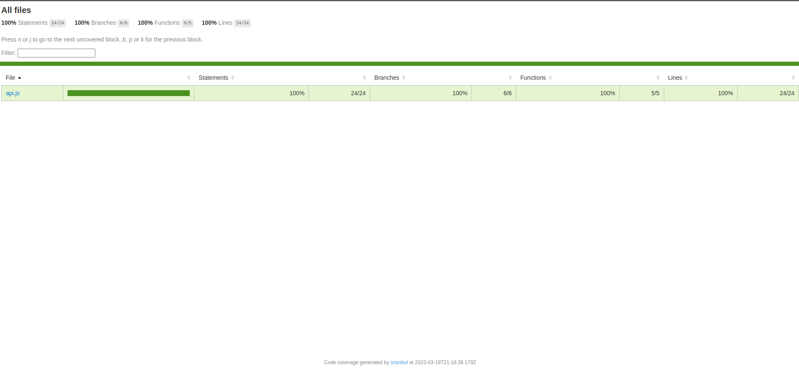

## 100% Testing

### Descrição

Projeto testado em 100% do código.

Esse projeto é uma API básica desenvolvida com o Node.js que consiste em três rotas: /contact, /hello e /login. A rota /contact retorna uma mensagem simples "contact us page". A rota /hello retorna a mensagem "Hello World". A rota /login é responsável por verificar as credenciais de usuário enviadas pelo cliente, e retornar um status de sucesso (200) caso as credenciais estejam corretas, ou um status de falha (401) caso as credenciais estejam incorretas.

O projeto utiliza o módulo http do Node.js para criar o servidor e o módulo supertest para testar a API. Os testes são escritos utilizando o framework de testes Mocha e asserções do módulo assert do Node.js.

